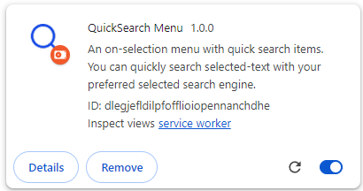
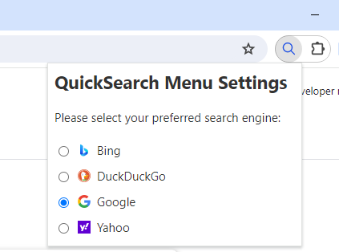
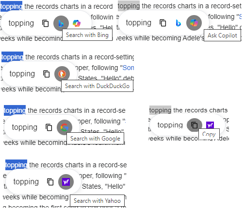
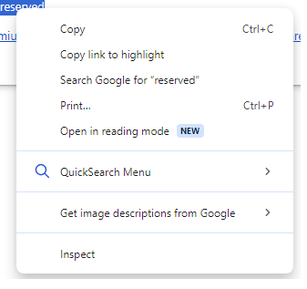
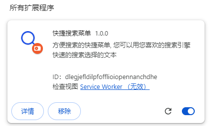
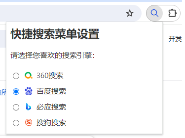
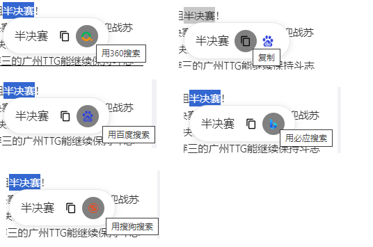
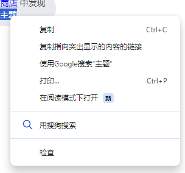

# Chromium QuickSearch extention

An chromium extension app shows menu for selected text, user can click the menu item to search selected text with prefered search engine. There are 2 menu types:

* right-click menu: injects menu items in the right-click menu.
* on-slected menu: pops up menu with items when user selects any text from web pages.

version: 1.0.0 - under development.

# Development

## Enviroment

* nodejs: >= v20.12.2

## Setup

1. sync code
2. npm install
3. npm run build (npm run clean)
4. load the pkg from dist with Chromium-based browser

## Supported Locales

1. en-US: [chromium.exe] --lang=zh-CN
2. zh-CN: [chromium.exe] --lang=en-US

## UI

* EN: Bing, DuckDuckGo, Google, Yahoo

  \
  \

* zh-CN： 360, Baidu, Bing, Sogou

  \
  \

## Version History

version: 1.0.0 - under development.